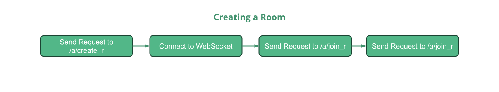

# Playshare Developer Documentation
**This is a work in progress / raw draft. We strongly advise you not to use these Resources as your single source of Truth**

# Getting Started
Getting Started with PlayShare Backend is easy. Before trying to implement our Service we recommend you to test out our Endpoints in for example [Postman](https://www.postman.com/) and a Simple Websocket Client or whatever you feel comfortable with! Just to make life easier for you we're supplying some Files for you to play Around in using [Huachao Mao's REST Client extension for VSC](https://marketplace.visualstudio.com/items?itemName=humao.rest-client).

# Requests process
